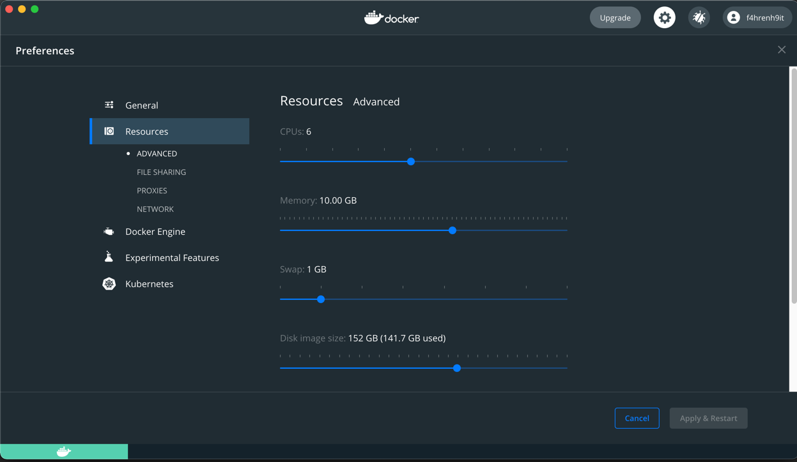

#### Local usage with k3d

1. Install `k3d` from [here](https://k3d.io/v5.4.1/)
2. Install `Lens` from [here](https://k8slens.dev/) or use `k9s` as a low resource consumption alternative from [here](https://k9scli.io/topics/install/)
3. Setup your docker, those settings are enough for most CL related tasks

4. `k3d cluster create local`
5. Check your contexts with `kubectl config get-contexts`
6. Switch context `kubectl config use-context k3d-local`
7. Spin up an env, for example
```
envcli new -p examples/presets/chainlink-starknet.yaml
```
7. Check created file in a previous command output, example `Environment setup and written to file environmentFile=chainlink-stark-mx7rg.yaml`
8. Connect to your env
```
envcli connect -e ${your_env_file_yaml}
```
9. Check the env file or connect command logs for a forwarded `local_ports` and try it in the browser
10. Destroy the env
```
envcli rm -e chainlink-stark-b7mt9.yaml
```
11. Stop the cluster
```
k3d cluster stop local
```